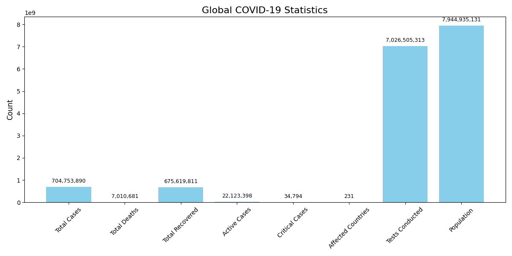

# 🦠 COVID-19 Data Visualization

This project visualizes the **latest global COVID-19 statistics** as a bar graph using Python, SQLite, and Matplotlib.

---

## 📊 Features

- Reads COVID-19 data from a local SQLite database
- Generates a **bar chart** for the latest statistics:
  - Total Cases
  - Total Deaths
  - Total Recovered
  - Active Cases
  - Critical Cases
  - Affected Countries
  - Tests Conducted
  - Population
- Saves the graph as an image (`covid_stats.png`)

---

## 🗂️ Project Structure

├── data/
│ ├── covid_data.json # Raw sample data (optional)
│ └── transformed_data.json # Cleaned data (optional)
├── covid_data.db # SQLite database with table global_covid_stats
├── visualize.py # Generates and saves the bar chart
├── load.py # Loads/transforms raw data into database
├── covid_stats.png # Output chart image
├── requirements.txt # Project dependencies
└── README.md # You're here!
